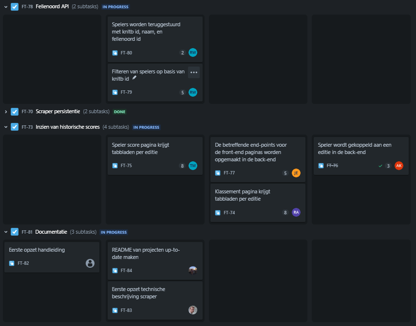

# Agile & Scrum

Tijdens het verloop van de ontwikkeling van het Leffe Circuit systeem maken wij gebruik van het Agile framework, en dan specifiek Scrum. Dit betekent dat wij in zogenoemde 'sprints' werken, dit zijn korte perioden waarin aan een van te voren bepaalde hoeveelheid features wordt gewerkt. Elke ontwikkelaar kan een taak oppakken en implementeren. Zodra een taak af is, dan kan deze worden gereviewed door de rest van het team, en kan een ontwikkelaar een nieuwe taak oppakken.

<figure><figcaption>
Het Scrum bord in de één-na-laatste sprint
</figcaption></figure>

Het scrum bord is de plaats waar de taken en hun status worden bijgehouden. Op het bord staan alleen taken van de huidige sprint waar aan wordt gewerkt. In ons geval kunnen taken 4 statussen hebben:

* To Do -> Deze taken zijn nog niet opgepakt
* In Progress -> Aan deze taken wordt actief gewerkt
* In verification -> Deze taken zijn afgerond maar wachten nog op verificatie/feedback
* Done -> Deze taken zijn afgerond en hoeft dus niks meer mee gedaan te worden

Elke taak krijgt ook een getal toegekend, namelijk de 'Story point estimate'. Dit getal is een combinatie van de hoeveelheid tijd en moeite die wij schatten dat er voor nodig is. Deze inschattingen maken we doormiddel van het zogenaamde 'Scrum Poker'. Elke speler kan dan een bepaald getal kiezen uit een vooraf gedefinieërde reeks, waarna er eventueel gediscussiëerd kan worden over de uitkomst mocht dit van toepassing zijn (bijvoorbeeld: iemand heeft heel hoog ingeschat terwijl de rest van het team lager heeft gekozen).

Aan het eind van elke sprint vindt een oplevring plaats samen met de Product Owners (de opdrachtgevers). Hierin wordt gedemonstreerd wat we bereikt hebben deze sprint, hoe het is gegaan, en wat we van plan zijn om te gaan doen in de volgende sprint. Daarna hebben de POs de kans om hier op feedback te geven of vragen te stellen.
